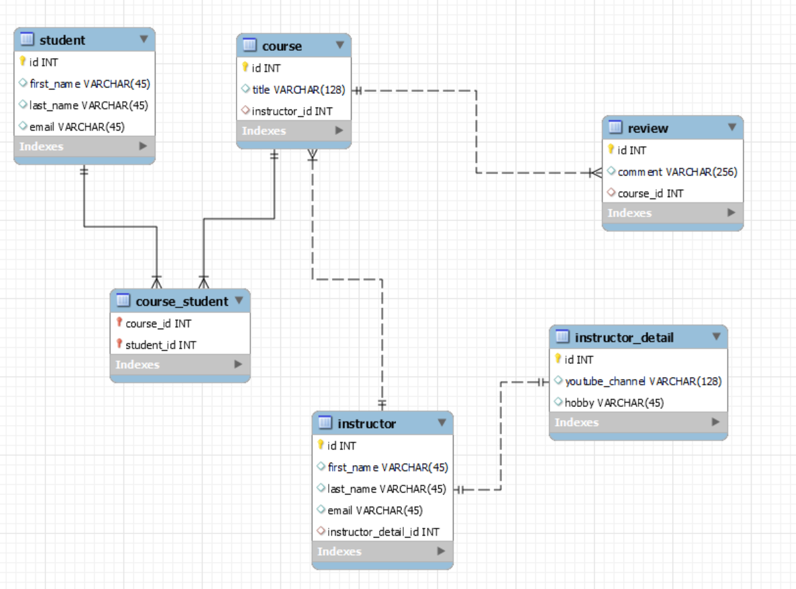

# Chapter 9 - JPA/Hibernate Advanced Mappings

- @OneToOne with Cascade All(Saving all attached object linked with a Foreign Key)
- DAO layer with EntityManager and save, Find By ID, Delete By ID
- Fetch Types(Eager, Lazy): Hibernate Session how to avoid Exception
- Bi-Directional(Delete and find go both ways and with Cascade All)
- @OneToMany and @ManyToOne
- CRUD with EntityManager
- Join Fetch
- @ManyToMany with @JoinTable(), joinColumns and inverseJoinColumns.

  